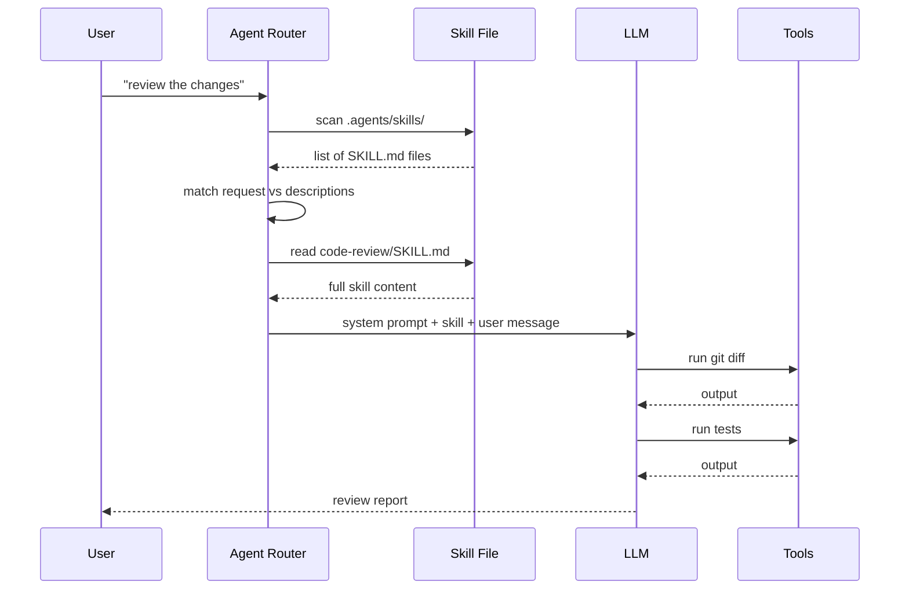

# Lesson 2: How Agents Talk to LLMs Using Skills

## The Conversation Flow

When you ask an agent to do something with skills, here's what happens under the hood:

### Step 1: Discovery (One-Time)

The agent scans your workspace for skill files. In your repo, this means finding every `SKILL.md` under `.agents/skills/` and reading their frontmatter:

```yaml
---
name: code-review
description: Review changes since a fixed commit...
disable-model-invocation: true
argument-hint: "Describe WHAT you're looking for"
---
```

The frontmatter is the **index** — the agent uses it to decide which skills to load later. It doesn't read the full file yet.

### Step 2: Routing (Per Request)

You type: *"review the changes since last commit"*

The agent matches your request against each skill's `description` and `argument-hint`. It picks the ones that seem relevant — in this case, `code-review` and maybe `diagnosing-bugs`.

### Step 3: Injection (The Key Moment)

For each selected skill, the agent reads the **full file** and prepends it to the system prompt. Here's what the LLM actually sees:

```
=== SYSTEM PROMPT ===
You are a helpful AI coding assistant.

=== SKILL: code-review ===
---
name: code-review
description: Review changes since a fixed point...
---

The user has asked you to review changes. Here's the process:

1. Run `git diff` to see what changed
2. Run tests to check for regressions
3. Report findings in this format: ...

=== USER MESSAGE ===
review the changes since last commit
```

The skill content becomes **part of the system prompt**. The LLM treats it exactly like its base instructions — it's just additional context telling it *how to behave* in this situation.

### Step 4: Execution

The LLM follows the skill's instructions. It might:
- Run commands (via the terminal tool)
- Read files (via the read tool)
- Call other tools
- Produce output

### The Message Flow Diagram



### What the LLM Actually Sees

The critical insight: **skills are just text in the system prompt**. The LLM doesn't know "skills" exist as a concept. It sees:

1. The base system prompt (its core identity)
2. Skill content (additional instructions, formatted as context)
3. The user's message
4. Tool definitions (what functions it can call)

The agent framework (Copilot, Claude Desktop, etc.) handles the routing. The LLM just sees text and responds to it.

### The Tool Definitions

Skills don't just add instructions — they also expose tools. When a skill says "run tests" or "read a file," the agent framework makes those tools available. The LLM can call them by outputting structured requests.

Here's a simplified view of what the LLM sees for tools:

```json
{
  "tools": [
    {
      "name": "read_file",
      "description": "Read the contents of a file",
      "parameters": {
        "filePath": "string",
        "startLine": "number",
        "endLine": "number"
      }
    },
    {
      "name": "runSubagent",
      "description": "Launch a new agent...",
      "parameters": {
        "prompt": "string",
        "description": "string"
      }
    }
  ]
}
```

The skill's instructions tell the LLM *when* and *how* to use these tools.

### Why This Architecture Matters

**Skills are plain text.** This means:

- **Version controlled** — they live in your repo, you can diff them
- **Collaborative** — your team can write and review skills
- **Modular** — each skill is a single file, easy to understand
- **Model-agnostic** — the same skill works with Claude, GPT, or any model that supports the right API
- **Instantly updateable** — edit the file, the skill changes immediately

### The Difference From Plugins or Extensions

| | Plugins/Extensions | Skills |
|---|---|---|
| Format | Compiled code, JSON configs | Plain text (.md) |
| Installation | npm install, VS Code marketplace | git clone, copy files |
| Update cycle | Publisher releases new version | Edit the .md file |
| Scope | Global or workspace | Repo-scoped |
| Language | Code (JS, Python, etc.) | Natural language |

Skills are **not** programs that run. They're instructions that the LLM reads and follows.

### Your Workspace Example

Look at the `code-review` skill in your workspace. It says:

```
Runs both reviews in parallel sub-agents and reports them side by side.
Use when the user wants to review a branch, a PR, or work-in-progress changes.
```

When you say "review my branch," the agent:
1. Finds `code-review/SKILL.md`
2. Injects its full content into the system prompt
3. The LLM reads the instructions: "run both reviews in parallel sub-agents"
4. The LLM calls `runSubagent` twice (once for Standards, once for Spec)
5. The LLM reads the results and synthesizes a report

The skill didn't *run* anything. It told the LLM *what to do*, and the LLM used its tools to do it.

## Key Takeaway

Skills are **routing metadata + instruction text**. The agent framework handles the routing. The LLM handles the execution. The skill is just text that bridges the two.

## Primary Source

Read [Anthropic's Tool Use docs](https://docs.anthropic.com/en/docs/build-with-claude/tool-use) to see the actual API. It shows how tool definitions and tool results flow between the LLM and the application.

## Follow-Up

Ask about:
- How skills are discovered in VS Code Copilot vs Claude Desktop
- The difference between system prompt injection and function calling
- How multiple skills interact when they're all loaded
- Any specific skill in your workspace and how it works

---

<div style="text-align: center; color: #888; font-size: 0.9em; margin-top: 2em;">
💡 Ask followup questions — I'm your teacher. Nothing here is set in stone.
</div>
