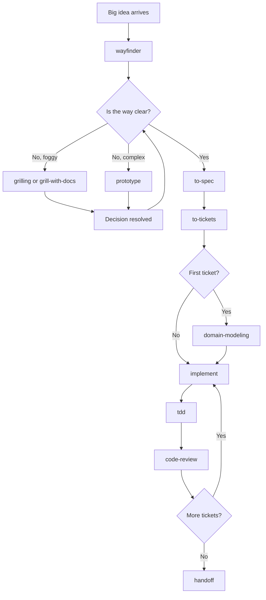

# Lesson 6: Matt Pocock's Skills Ecosystem

## The Big Picture

Matt Pocock's skills are not a random collection — they form a **coherent workflow** for software development. Understanding the categories and how they compose is the key to using them effectively.

## The Categories

There are six categories of skills in the ecosystem:

### 1. Planning Skills — "What should we do?"

These skills help you **find the way** when the problem is foggy.

| Skill | What it does | Trigger |
|---|---|---|
| [`wayfinder`](../../wayfinder/SKILL.md) | Break a big effort into decision tickets on the issue tracker | "I have a big idea but don't know where to start" |
| [`grilling`](../../grilling/SKILL.md) | Interview the user until a shared understanding emerges | "stress-test my plan," "grill me" |
| [`grill-with-docs`](../../grill-with-docs/SKILL.md) | Grilling + creates ADRs and glossary as you go | "grill me and document the decisions" |
| [`prototype`](../../prototype/SKILL.md) | Build a throwaway prototype to answer a design question | "sanity-check this design" |

**How they compose:** You start with `wayfinder` to map the effort. Each decision ticket may need `grilling` to resolve. Complex decisions may need a `prototype` to validate.

### 2. Specification Skills — "What are we building?"

These skills turn a plan into a **spec or tickets** that an agent can execute.

| Skill | What it does | Trigger |
|---|---|---|
| [`to-spec`](../../to-spec/SKILL.md) | Synthesize conversation into a spec and publish to tracker | "turn this into a spec" |
| [`to-tickets`](../../to-tickets/SKILL.md) | Break a spec into tracer-bullet tickets with blocking edges | "break this into tickets" |
| [`to-questionnaire`](../../to-questionnaire/SKILL.md) | Turn an undecidable decision into a questionnaire for someone else | "I need info from someone who knows more" |

**How they compose:** `to-spec` → `to-tickets` is the default flow. `to-questionnaire` feeds into `to-spec` when you need external input.

### 3. Design Skills — "How should we structure it?"

These skills provide **vocabulary** for designing module interfaces.

| Skill | What it does | Trigger |
|---|---|---|
| [`codebase-design`](../../codebase-design/SKILL.md) | Deep module vocabulary: module, seam, depth, leverage | "design this interface," "deepen this module" |
| [`domain-modeling`](../../domain-modeling/SKILL.md) | Build and sharpen the project's domain model | "pin down our terminology," "update the glossary" |

**How they compose:** `domain-modeling` establishes the ubiquitous language. `codebase-design` uses that language to design interfaces.

### 4. Execution Skills — "Build it."

These skills **implement** the work.

| Skill | What it does | Trigger |
|---|---|---|
| [`implement`](../../implement/SKILL.md) | Implement a spec or set of tickets | "implement this spec" |
| [`tdd`](../../tdd/SKILL.md) | Test-driven development loop | "red-green-refactor this" |
| [`code-review`](../../code-review/SKILL.md) | Review changes against standards and spec | "review the changes since X" |

**How they compose:** `implement` → `tdd` for each ticket → `code-review` when done.

### 5. Communication Skills — "Share what happened."

These skills handle **handoffs and clarifications**.

| Skill | What it does | Trigger |
|---|---|---|
| [`handoff`](../../handoff/SKILL.md) | Compact a conversation into a handoff for another agent | "summarize this for the next session" |
| [`wait-what`](../../wait-what/SKILL.md) | Stop and ask for clarification | "I lost context, re-pitch it" |

### 6. Configuration Skills — "Set things up."

These skills **configure the workspace** so other skills work.

| Skill | What it does | Trigger |
|---|---|---|
| [`setup-matt-pocock-skills`](../../setup-matt-pocock-skills/SKILL.md) | Configure issue tracker, triage labels, domain docs | First-time setup |
| [`triage`](../../triage/SKILL.md) | Move issues through a state machine | "triage this issue" |

## The Workflow

Here's how the skills compose into a development workflow:



### The Decision Loop

The key insight: **wayfinder creates a loop, not a straight line.**

1. Start with a big idea → `wayfinder` creates a map of decision tickets
2. Each decision ticket → `grilling` or `prototype` to resolve it
3. When all decisions are resolved → `to-spec` to synthesize the plan
4. `to-tickets` to break it into tracer bullets
5. `implement` + `tdd` + `code-review` for each ticket
6. `handoff` when the session ends

This is why the skills are called "skills" and not "prompts." Each skill is a **role** the agent adopts. The workflow is the sequence of roles.

## The Matt Pocock Design Principles

Behind the skills are several design principles that distinguish this framework:

### 1. Skills are roles, not scripts

A skill doesn't tell the agent *what to do* — it tells the agent *who to be*. The agent then decides what to do based on that role.

Compare:

- **Script**: "Run `git log`, then write a file, then commit"
- **Role**: "You are a tester following the red-green loop. Explore the codebase, find seams, and design tests."

The role approach is more flexible because the agent adapts to the specific situation.

### 2. The workflow is the composition

No single skill does everything. The power comes from **chaining skills** — each one produces output the next one consumes.

```
wayfinder output → to-spec input
to-spec output → to-tickets input
to-tickets output → implement input
implement output → code-review input
```

Each skill's output is designed to be the next skill's input. This is why the spec template, ticket format, and review criteria are all aligned.

### 3. Human judgement at decision points

The workflow puts the **human** at every decision point:

```
wayfinder → human picks a ticket → grilling → human decides → ...
```

The agent never makes a decision — it surfaces options, the human chooses.

### 4. The issue tracker is the shared memory

All decisions, specs, and tickets live in the issue tracker. This is the **shared memory** of the workflow:

- `wayfinder` writes decision tickets
- `to-spec` writes a spec
- `to-tickets` writes tracer bullets
- `triage` moves issues through states

The tracker is the **source of truth** that survives any single session.

### 5. Progressive disclosure of complexity

Each skill is **simple in isolation** but **rich in composition**:

- `grilling` is ~30 lines — just "ask questions, update the frontier"
- `tdd` is ~60 lines — just "red-green loop rules"
- `wayfinder` is complex — but only because it composes the simpler skills

This is the opposite of a monolithic agent framework. Each skill is a **LEGO brick** — simple, composable, replaceable.

## Your Workspace: How It's Set Up

Your repo has the **configuration** already done:

- **Issue tracker**: GitHub (via `gh` CLI) — configured in `docs/agents/issue-tracker.md`
- **Triage labels**: canonical names mapped to tracker labels — in `docs/agents/triage-labels.md`
- **Domain docs**: single-context layout with `CONTEXT.md` + `docs/adr/` — in `docs/agents/domain.md`

This means all the workflow skills (`wayfinder`, `to-spec`, `to-tickets`, `triage`) will work out of the box.

## Exercise: Map a Real Workflow

Take a real task you're working on and map it to the skill workflow:

1. **What category does the task start in?** (Planning, specification, design, execution)
2. **What skill chain would you follow?** (e.g., `grilling` → `to-spec` → `to-tickets`)
3. **Where does the human decide?** (Identify the decision points)
4. **What's the shared memory?** (Which issue tracker artifacts would hold the output)

## Primary Source

Read the [Matt Pocock skills README](https://github.com/mattpocock/skills) for the official explanation of the framework's design. Focus on how the skills are organized and how they compose.

## Follow-Up

Ask about:
- How to add a new skill to the ecosystem
- How skills differ from other patterns (plugins, MCP servers, custom instructions)
- The `to-questionnaire` skill in detail — when to use it vs. `to-spec`
- How to evaluate whether a skill is worth adding to your workflow
- Any part of the ecosystem that feels unclear

---

<div style="text-align: center; color: #888; font-size: 0.9em; margin-top: 2em;">
💡 Ask followup questions — I'm your teacher. Nothing here is set in stone.
</div>
