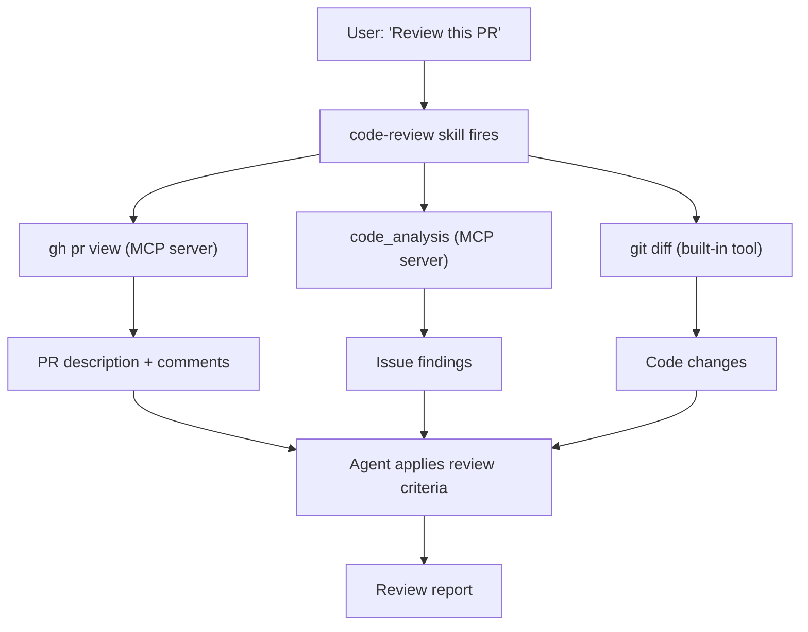

# Lesson 9: Combining Skills with MCP Servers

## The Core Idea

Skills and MCP servers operate at different layers of the agent stack:

```
┌─────────────────────────────────────┐
│       User Request                   │
├─────────────────────────────────────┤
│  Skills: "how to think" (text)      │  ← Cognitive layer
│  MCP: "what to access" (tools)      │  ← Operational layer
├─────────────────────────────────────┤
│  Agent: route, invoke, compose      │  ← Orchestrator
├─────────────────────────────────────┤
│  Tools: file system, terminal, etc. │  ← Built-in tools
└─────────────────────────────────────┘
```

A skill tells the agent *what to do*. An MCP server gives the agent *new things to do*. The skill can reference MCP tools just like it references built-in tools — they appear in the same tool list.

## Pattern 1: Skill as a Workflow Over MCP Tools

The simplest pattern: a skill defines a multi-step workflow, and the steps call MCP tools.

### Example: A "Research a Topic" Skill

```yaml
---
name: research-topic
description: >
  Investigate a topic against high-trust sources and produce a summary.
  Use when the user wants to research a question, gather facts, or
  compare options. Requires a web-search MCP server to be configured.
argument-hint: "The topic to research"
disable-model-invocation: true
---
```

```markdown
# Research a Topic

Investigate a topic against high-trust sources and produce a summary.

## Process

### 1. Clarify the scope

Ask the user to narrow the topic if it's too broad. Done when you have a specific question.

### 2. Search for sources

Use the `web_search` tool (from your MCP server) to find 3–5 high-trust sources. Prefer:
- Official documentation over blog posts
- Primary sources over secondary summaries
- Recent sources (within 2 years) over older ones

### 3. Fetch and extract

Use the `web_fetch` tool (from your MCP server) to read each source. Extract the key facts.

### 4. Synthesize

Write a summary with citations. Save to `research/<topic-slug>.md`.

## Rules

- Every claim must have a citation link
- If sources conflict, note the conflict
- Prefer the most specific source for each claim
```

**How it works:** The skill provides the *cognitive framework* (what to search for, how to evaluate sources, what to synthesize). The MCP server provides the *operational capability* (web search, web fetch). Without the MCP server, the skill can't run. Without the skill, the MCP tools are just raw search — no framework for using them well.

## Pattern 2: Conditional MCP Invocation

A skill may need different MCP tools depending on the situation. The skill's instructions decide *which* MCP tool to call.

### Example: A "Debug a Bug" Skill

```markdown
## Process

### 1. Diagnose the error

Read the error message. Determine the category:

- **Build error** → use the `build_analyze` MCP tool
- **Test failure** → use the `test_debug` MCP tool
- **Runtime error** → use the `log_query` MCP tool (from your MCP server)

### 2. Apply the fix

Based on the diagnosis, use the appropriate MCP tool's output to guide the fix.
```

The skill's instructions are the **router** between MCP tools. This is why skills matter — without them, the agent has a list of tools but no guidance on which to use when.

## Pattern 3: MCP Server as a Knowledge Source for Skills

An MCP server can provide structured data that a skill uses as **context**. The skill reads the data and applies its reasoning framework to it.

### Example: A "Code Review" Skill with a Code Analysis MCP

```markdown
## Process

### 1. Get the diff

Use `git diff` (built-in terminal tool) to get the changes.

### 2. Enrich with MCP analysis

Use the `code_analysis` MCP server to:
- Run `find_issues` on the diff → returns potential bugs
- Run `find_complexity` on the diff → returns complexity hotspots

### 3. Review with the skill's framework

Apply the code-review skill's criteria (standards + spec compliance) to:
- The raw diff
- The MCP server's issue findings
- The MCP server's complexity findings
```

The MCP server is a **lens** — it surfaces things the agent might miss. The skill's framework is the **judgment** — it decides what matters.

## Pattern 4: Skill-to-Skill Chaining with MCP in the Middle

One skill's output feeds into another skill, with an MCP tool bridging them.

```
to-spec (writes a spec to disk)
    ↓
[agent reads the spec]
    ↓
to-tickets (reads the spec, creates tickets)
    ↓
MCP tool: gh issue create (publishes to GitHub)
    ↓
implement (reads the tickets, starts building)
```

The MCP tool is the **bridge** between skills. Without it, the output of one skill would be trapped in the agent's context — not persisted to the issue tracker.

## Pattern 5: MCP Server Configuration as a Skill

Setting up an MCP server is a manual, error-prone process. A skill can guide it.

### The `mcp-setup` Skill

```yaml
---
name: mcp-setup
description: >
  Walk through configuring an MCP server for the current workspace.
  Use when adding a new MCP server or troubleshooting MCP connectivity.
argument-hint: "The MCP server name or URL"
disable-model-invocation: true
---
```

```markdown
# Configure an MCP Server

Walk through setting up an MCP server for the current workspace.

## Process

### 1. Identify the server

Ask the user which MCP server they want to configure (e.g., "github," "filesystem," "web-search").

### 2. Check prerequisites

For the selected server, check:
- Is it installed? (`which <server-name>`)
- Are credentials configured? (check for relevant env vars)
- Is the server running? (`<server-name> --version`)

### 3. Configure the workspace

Add the server to `.vscode/mcp.json` (or the appropriate config file):

```json
{
  "servers": [
    {
      "name": "<server-name>",
      "command": "<command>",
      "args": ["<arg1>", "arg2"],
      "env": { "API_KEY": "<value>" }
    }
  ]
}
```

### 4. Verify

Test the connection: `<server-name> --ping`. If it fails, show the error and suggest fixes.
```

This is a rare case where a skill **configures another system**. The skill's value is in the step-by-step guidance — without it, the agent might skip steps or assume things.

## The Composition Model

Here's how skills and MCP servers compose in a real workflow:



The flow:

1. **Skill fires** — the `code-review` skill is invoked
2. **Skill directs tool use** — the skill tells the agent to call both built-in tools (git diff) and MCP tools (gh pr view, code_analysis)
3. **Tools return data** — each tool produces output
4. **Skill's framework judges** — the agent applies the skill's review criteria to all the data
5. **Output** — the review report

## Designing Skills That Use MCP Tools

When writing a skill that depends on MCP tools, follow these conventions:

### 1. Document the MCP dependency in the description

```yaml
description: >
  Investigate a topic against high-trust sources.
  Requires: web-search MCP server configured.
```

This tells the user (and the agent router) that the skill has an operational dependency.

### 2. Name MCP tools explicitly

```markdown
Use the `web_search` tool (from your MCP server) to find sources.
```

Not: "search the web." The agent needs to know *which* tool to call.

### 3. Handle MCP failures gracefully

```markdown
If the MCP server is unavailable, fall back to:
- Using the built-in search tool (if available)
- Asking the user to provide URLs manually
```

Don't assume the MCP server is always available.

### 4. Map MCP tool names to the skill's mental model

The skill's language should be **independent of any specific MCP implementation**:

```markdown
Good: "Search for high-trust sources about the topic"
Bad: "Call the `web_search` tool with the query parameter"
```

The first describes the *intent*. The second describes the *mechanism*. Use intent in the skill, mechanism in the tool call.

## When NOT to Use MCP

MCP adds complexity. Don't use it when:

| MCP adds value when... | Skip MCP when... |
|---|---|
| You need real-time data | The data is static (in the codebase) |
| You need to call an external API | The agent's built-in tools suffice |
| You need specialized tools (code analysis, log querying) | A simple `curl` or `gh` command works |
| Multiple agents need the same tool | Only one agent needs it |

## Exercise: Map Your Tools

Take a skill you've written (or the `research-topic` skill from this lesson) and map its tool dependencies:

| Tool | Type | Why needed? | Fallback? |
|---|---|---|---|
| `git diff` | Built-in | Get the changes | None |
| `web_search` | MCP | Find sources | Ask user for URLs |
| `web_fetch` | MCP | Read sources | Manual copy-paste |
| `code_analysis` | MCP | Find issues | Manual review |

## Primary Source

Read the [MCP Introduction](https://modelcontextprotocol.io/introduction) for the official protocol specification. Focus on how MCP tools are discovered, described, and invoked — this is how the agent sees MCP tools when they're configured.

## Follow-Up

Ask about:
- How to write an MCP server (the other side of the equation)
- How to test a skill that depends on MCP tools (without the server running)
- How to handle MCP tool name conflicts (two servers exposing the same tool name)
- Any part of the combination patterns that feels unclear

---

<div style="text-align: center; color: #888; font-size: 0.9em; margin-top: 2em;">
💡 Ask followup questions — I'm your teacher. Nothing here is set in stone.
</div>
